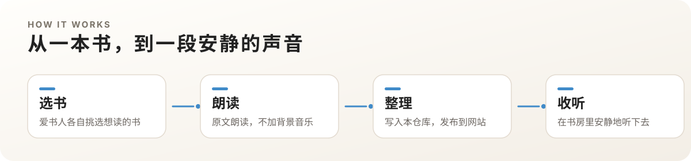

<p align="center">
  
</p>

<p align="center">
  <a href="https://shufang.org"><strong>shufang.org</strong></a>
  ·
  <a href="https://github.com/shufangOrg/shufang.org/actions/workflows/gh-pages.yml"></a>
</p>

「一个人的书房」是一个始于 2013 年的网络电台与网站仓库：爱书人选择自己喜欢的书，进行**原文朗读**——不声情并茂，不加背景音乐，希望回归到文字本身、声音本身。

若以书而论，每本书都会变成你自己的房间，给你一个庇护，让你安静下来。

---

<p align="center">
  
</p>

- 网站：[shufang.org](https://shufang.org)
- 朗读书目：[/books](https://shufang.org/books.html)
- 播客节目：[/tags/podcast.html](https://shufang.org/tags/podcast.html)
- 关于书房：[/about.html](https://shufang.org/about.html)

---

<p align="center">
  
</p>

我们不把朗读做成表演，也不用音乐填满沉默。节目尽量让文字自己站在听者面前——这就是书房常说的「用声音裸泳」。

本仓库是 **一个人的书房 2.0** 的 Hugo 站点源码：书目、节目页、读者与站点配置都在这里维护，构建后发布到 [shufang.org](https://shufang.org)。

<p align="center">
  
</p>

---

<p align="center">
  
</p>

### 环境

仓库提供 Nix flake 开发环境（Hugo Extended 0.87.0 等）。若已安装 Nix：

```bash
nix develop
hugo server
```

也可使用本机已安装的 Hugo Extended，在仓库根目录运行 `hugo server` 后访问本地预览地址。

### 仓库里有什么

| 路径 | 内容 |
| --- | --- |
| `content/books/` | 朗读书目 |
| `content/podcast/` | 播客节目页 |
| `content/blog/` | 站点文章 |
| `layouts/` | Hugo 模板 |
| `static/` | 图片与静态资源 |
| `config.yaml` | 站点与播客配置 |

---

## 参与与文档

- 议题与待办：[GitHub Issues](https://github.com/shufangOrg/shufang.org/issues)
- 维基：[Wiki](https://github.com/shufangOrg/shufang.org/wiki)
- 联系：hi@shufang.org

## Contributors

<a href="https://github.com/shufangOrg/shufang.org/graphs/contributors">
  
</a>

Made with [contrib.rocks](https://contrib.rocks).

---

## README visuals

本页视觉与排版由 [beautify-github-readme](https://github.com/oil-oil/beautify-github-readme) 围绕「一个人的书房」站点气质重新设计；动图由该 Skill 附带的 `render_motion_gif.py` 工作流生成。

<p align="center">
  <a href="https://github.com/oil-oil/beautify-github-readme"></a>
</p>
